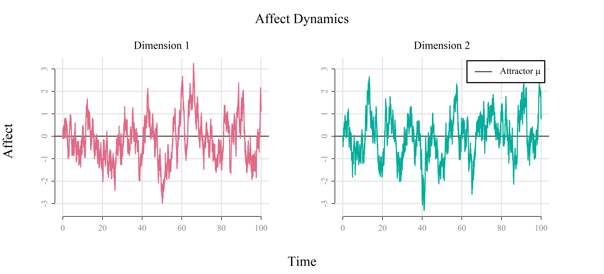

<!-- README.md is generated from README.Rmd. Please edit that file -->

# affectOU: Simulate Affect Dynamics with Ornstein-Uhlenbeck Processes

<!-- badges: start -->

[](https://app.codecov.io/gh/KCEvers/affectOU)
[](https://github.com/KCEvers/affectOU/actions/workflows/R-CMD-check.yaml)
<!-- badges: end -->

The aim of `affectOU` is to provide tools for simulating and analyzing
the Ornstein-Uhlenbeck (OU) process in R. The OU process models how
variables change over time while being influenced by random
perturbations. It is widely used to model affect dynamics in psychology,
formulating three core psychological mechanisms (assuming a
unidimensional process for simplicity):

  - **θ (theta): emotion regulation capacity**
    
    Governs the rate at which affect returns to baseline. Low θ
    indicates *emotional inertia* or *rumination*; high θ indicates
    rapid regulation.

  - **μ (mu): affective set point**
    
    The long-term average level of affect that the system tends to
    return to. This could represent an individual’s baseline mood or
    emotional equilibrium.

  - **γ (gamma): emotional reactivity**
    
    Controls the magnitude of short-term fluctuations or noise in the
    affective system. This can be interpreted as an individual’s
    sensitivity to environmental perturbations.

`affectOU` serves as a demonstration of how to package computational
models, as detailed in Evers & Vanhasbroeck (2026), “Sharing
Computational Models as Reproducible and User-Friendly Packages: A
Tutorial in R” (forthcoming).

## Installation

The development version of affectOU can be installed from
[GitHub](https://github.com/KCEvers/affectOU) with:

``` r
# install.packages("pak")
pak::pak("KCEvers/affectOU")
```

## Quick Start

``` r
library(affectOU)
```

``` r
# Create two-dimensional OU
model <- affectOU(ndim = 2)
model
#> 
#> ── 2D Ornstein-Uhlenbeck Model ─────────────────────────────────────────────────
#> dX(t) = Θ(μ − X(t))dt + Γ dW(t)
#> 
#> μ = [0.000, 0.000]
#> 
#> Θ:
#>      [,1] [,2]
#> [1,]  0.5  0.0
#> [2,]  0.0  0.5
#> 
#> Γ:
#>      [,1] [,2]
#> [1,]    1    0
#> [2,]    0    1
#> 
#> Σ = ΓΓᵀ:
#>      [,1] [,2]
#> [1,]    1    0
#> [2,]    0    1
```

``` r
# Run three simulations
sim <- simulate(model, nsim = 3)
plot(sim)
```



## Tutorials

For more detailed examples and visual demonstrations of the model’s
characteristics, see the vignettes:

  - [Get Started with affectOU](articles/affectOU.html)
  - [Affect Characteristics Implied by the OU
    Process](articles/characteristics.html)

## References

Uhlenbeck & Ornstein (1930)
[doi:10.1103/PhysRev.36.823](https://libkey.io/libraries/1691/10.1103/PhysRev.36.823)

Oravecz, Tuerlinckx & Vandekerckhove (2009)
[doi:10.1007/s11336-008-9106-8](https://libkey.io/libraries/1691/10.1007/s11336-008-9106-8)

Kuppens, Allen & Sheeber (2010)
[doi:10.1177/0956797610372634](https://libkey.io/libraries/1691/10.1177/0956797610372634)

Kuppens, Oravecz & Tuerlinckx (2010)
[doi:10.1037/a0020962](https://libkey.io/libraries/1691/10.1037/a0020962)
