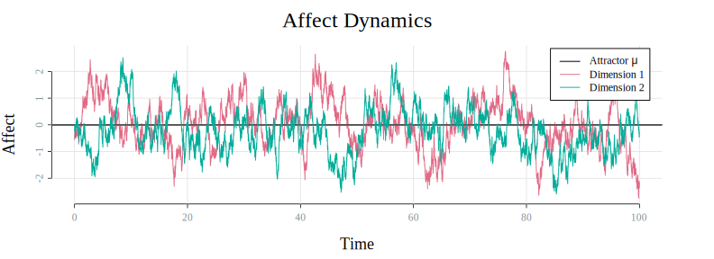

<!-- README.md is generated from README.Rmd. Please edit that file -->

# affectOU: Ornstein-Uhlenbeck Model for Affect Dynamics

<!-- badges: start -->

[](https://app.codecov.io/gh/KCEvers/affectOU)
[](https://github.com/KCEvers/affectOU/actions/workflows/R-CMD-check.yaml)
<!-- badges: end -->

The aim of `affectOU` is to provide tools for simulating the
Ornstein-Uhlenbeck (OU) process in R. The OU is widely used to model
affect dynamics: how feelings or emotions change over time (e.g.,
Guthier et al., 2020; Kuppens et al., 2010a; Voelkle & Oud, 2013). It
formulates three core psychological mechanisms through three sets of
parameters (Uhlenbeck & Ornstein, 1930; Oravecz et al., 2011):

- **Drift matrix Θ:** Governs the rate at which affect returns to
  baseline, capturing a person’s *emotion regulation capacity* or
  *emotional inertia*;
- **Attractor μ:** The long-term average level of affect that the system
  tends to return to, representing a person’s *baseline mood* or
  *emotional setpoint*;
- **Diffusion matrix Γ:** Controls the magnitude of short-term
  fluctuations or noise in the affective system, characterizing an
  individual’s *reactivity* or *sensitivity* to environmental
  perturbations.

`affectOU` primarily serves as a demonstration of a packaged
computational model, as detailed in Evers & Vanhasbroeck (2026),
“Sharing Computational Models as Reproducible and User-Friendly
Packages: A Tutorial in R” (forthcoming).

## Installation

`affectOU` can be installed from
[GitHub](https://github.com/KCEvers/affectOU) with:

``` r
# install.packages("pak")
pak::pak("KCEvers/affectOU")
```

Once installed, one can use the package through calling the `library()`
function.

``` r
library(affectOU)
```

## Quick Start

<!-- The chief functionalities of the package revolve around a user-specified OU model of a particular dimensionality. To create such a model, one should use the [`affectOU()`](https://kcevers.github.io/affectOU/reference/affectOU.html) function and specify its dimensionality and/or parameters (see [Get Started](https://kcevers.github.io/affectOU/articles/affectOU.html)). For example, the following call creates a two-dimensional OU model with default parameter values: -->

The core functionality of the package revolves around an OU model object
created by the function
[`affectOU()`](https://kcevers.github.io/affectOU/reference/affectOU.html).
For example, the following creates a two-dimensional model with default
parameter values:

``` r
model <- affectOU(ndim = 2)
```

``` r
print(model)
#> 
#> ── 2D Ornstein-Uhlenbeck Model ─────────────────────────────────────────────────
#> dX(t) = Θ(μ − X(t))dt + Γ dW(t)
#> 
#> μ = [0.000, 0.000]
#> 
#> Θ:
#>      [,1] [,2]
#> [1,]  0.5  0.0
#> [2,]  0.0  0.5
#> 
#> Γ:
#>      [,1] [,2]
#> [1,]    1    0
#> [2,]    0    1
#> 
#> Σ = ΓΓᵀ:
#>      [,1] [,2]
#> [1,]    1    0
#> [2,]    0    1
```

``` r
summary(model)
#> 
#> ── 2D Ornstein-Uhlenbeck Model ─────────────────────────────────────────────────
#> 
#> ── Dynamics ──
#> 
#> Stable (node)
#> 
#> ── Stationary distribution ──
#> 
#> Mean: [0, 0]
#> SD: [1, 1]
#> 
#> ── Structure ──
#> 
#> Coupling: none
#> Noise: independent
```

The model can then be simulated with
[`simulate()`](https://kcevers.github.io/affectOU/reference/simulate.affectOU.html)
and visualised over time with
[`plot()`](https://kcevers.github.io/affectOU/reference/plot.simulate_affectOU.html).

``` r
sim <- simulate(model)
```

``` r
plot(sim)
```



## Explore the OU Process

For more detailed examples and visual demonstrations of the model’s
characteristics, see the vignettes:

- [Get started with
  affectOU](https://kcevers.github.io/affectOU/articles/affectOU.html)
- [Affect characteristics implied by the OU
  process](https://kcevers.github.io/affectOU/articles/characteristics.html)

More ways to visualise the OU are offered in
[`plot()`](https://kcevers.github.io/affectOU/reference/plot.simulate_affectOU.html).
Its theoretical properties are further explained in the function
documentation of
[`stability()`](https://kcevers.github.io/affectOU/reference/stability.affectOU.html)
and
[`stationary()`](https://kcevers.github.io/affectOU/reference/stationary.affectOU.html).
For fitting unidimensional OU models to data, see
[`fit()`](https://kcevers.github.io/affectOU/reference/fit.affectOU.html).

## References

Evers, K. C. & Vanhasbroeck, N. (2026). *Sharing computational models as
reproducible and user-friendly packages: A tutorial in R.* Manuscript in
preparation.

Guthier, C., Dormann, C., & Voelkle, M. C. (2020). Reciprocal effects
between job stressors and burnout: A continuous-time meta-analysis of
longitudinal studies. *Psychological Bulletin, 146*, 1146-1173. doi:
[10.1037/bul0000304](https://doi.org/10.1037/bul0000304)

Kuppens, P., Oravecz, Z., & Tuerlinckx, F. (2010). Feelings change:
Accounting for individual differences in the temporal dynamics of
affect. *Journal of Personality and Social Psychology, 99*, 1042-1060.
doi: [10.1037/a0020962](https://doi.org/10.1037/a0020962)

Oravecz, Z., Tuerlinckx, F., & Vandekerckhove, J. (2011). A hierarchical
latent stochastic differential equation model for affective dynamics.
*Psychological Methods, 16*, 468-490. doi:
[10.1037/a0024375](https://doi.org/10.1037/a0024375)

Uhlenbeck, G. E. & Ornstein, L. S. (1930). On the theory of Brownian
motion. *Physical Review, 46*, 823-841.

Voelkle, M. C. & Oud, J. H. L. (2013). Continuous time modelling with
individually varying time intervals for oscillating and non-oscillating
processes. *British Journal of Mathematical and Statistical Psychology,
66*, 103-126. doi:
[10.1111/j.2044-8317.2012.02043.x](https://doi.org/10.1111/j.2044-8317.2012.02043.x)
