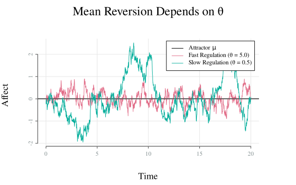
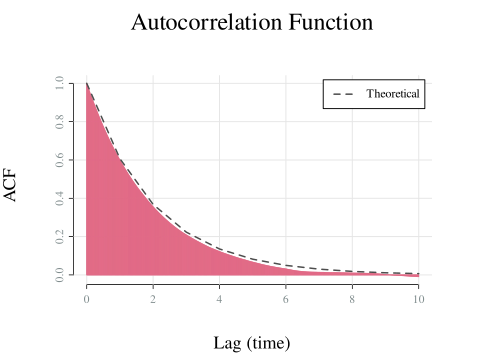
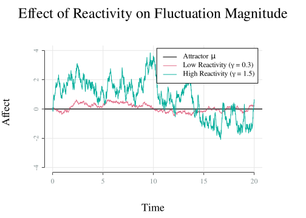
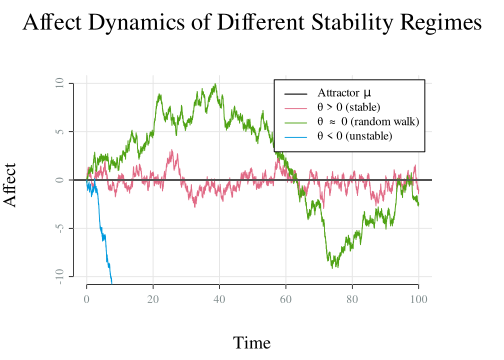
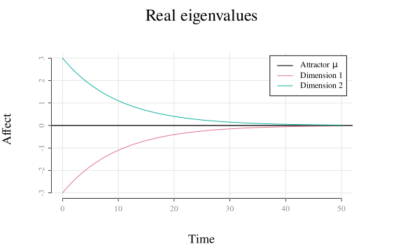
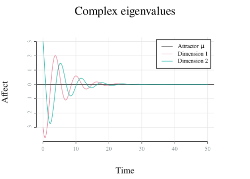
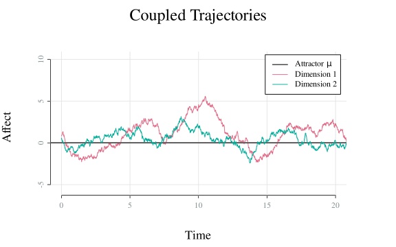
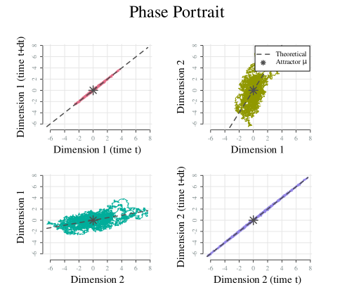
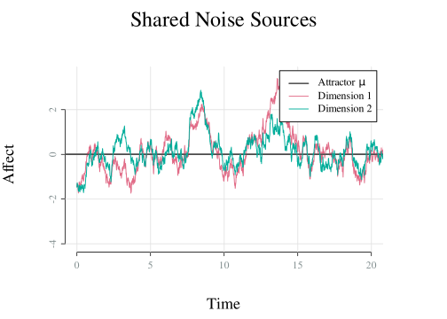

# Affect characteristics implied by the OU Process

``` r
library(affectOU)
```

Modelling affect with the Ornstein-Uhlenbeck (OU) process implies affect
dynamics are characterized by several distinct features. This vignette
demonstrates each feature visually. For mathematical definitions of the
quantities shown here, see
[`stability()`](https://kcevers.github.io/affectOU/reference/stability.affectOU.md),
[`stationary()`](https://kcevers.github.io/affectOU/reference/stationary.affectOU.md),
and
[`relaxation()`](https://kcevers.github.io/affectOU/reference/relaxation.affectOU.md).

## 1. Mean Reversion

After perturbations, affect returns toward its baseline \\\mu\\ at a
rate determined by \\\theta\\ (for stable, unidimensional systems). High
\\\theta\\ indicates rapid regulation; low \\\theta\\ indicates
emotional inertia.

Show code

``` r
model <- affectOU(theta = diag(c(5.0, 0.5)))
sim <- simulate(model, seed = 123, stop = 20, initial_state = 3)
plot(sim,
  main = "Mean Reversion Depends on θ",
  sub = c("Fast Regulation (θ = 5.0)", "Slow Regulation (θ = 0.5)")
)
```



## 2. Perturbation Persistence

The relaxation time \\\tau = 1/\theta\\ is the characteristic time scale
of the OU process—the time for the expected deviation to shrink to \\1/e
\approx 36.8\\\\. The half-life \\t\_{1/2} = \ln 2 \cdot \tau\\ marks
the 50% point. Effects decay exponentially: at two \\\tau\\, about 13.5%
remains; at three \\\tau\\, about 5%.

``` r
model <- affectOU(theta = 0.5, mu = 0, gamma = 1)
relaxation(model)
#> 
#> ── Relaxation time of 1D Ornstein-Uhlenbeck Model ──
#> 
#> Relaxation time (τ): 2 time units
#> Half-life (t₁/₂): 1.386 time units
#> 
#> Time for perturbation to decay to:
#>      50%     37%     14%      5%      1%
#>    1.386   2.000   4.000   6.000  10.000
```

Show code

``` r
# Simulate with more time points for accurate ACF
sim <- simulate(model, stop = 10000, dt = 0.01, save_at = 0.01)
plot(sim, type = "acf", lag.max = 10)
```



The ACF equals \\1/e\\ at the relaxation time and \\0.5\\ at the
half-life. Slow regulation means longer persistence and higher
autocorrelation. See
[`relaxation()`](https://kcevers.github.io/affectOU/reference/relaxation.affectOU.md)
for more details on this concept and its interpretations.

## 3. Reactivity

The parameter \\\gamma\\ controls the magnitude of random
perturbations—emotional reactivity to environmental fluctuations.

Show code

``` r
model <- affectOU(theta = 0.5, mu = 0, gamma = diag(c(0.3, 1.5)))
sim <- simulate(model, seed = 456, stop = 20)
plot(sim,
  sub = c("Low Reactivity (γ = 0.3)", "High Reactivity (γ = 1.5)"),
  main = "Effect of Reactivity on Fluctuation Magnitude", ylim = c(-4, 4)
)
```



Higher \\\gamma\\ produces larger fluctuations around the attractor.

## 4. Stability Regimes

### Univariate

The sign of \\\theta\\ determines qualitative behaviour:

- **\\\theta \> 0\\**: Stable. Mean-reverting around \\\mu\\. Affect
  fluctuates within a bounded range.
- **\\\theta \approx 0\\**: Random walk. No attractor; variance grows
  over time. Affect drifts without returning.
- **\\\theta \< 0\\**: Unstable. Exponential divergence from \\\mu\\.
  Small perturbations amplify.

Show code

``` r
model <- affectOU(theta = diag(c(0.5, 0.01, -0.3)))
sim <- simulate(model, stop = 100, seed = 43)
#> Warning: ! System is not stable; no stationary distribution exists.
#> ℹ Defaulting `initial_state` to mu.
plot(sim,
  ylim = c(-10, 10),
  main = "Affect Dynamics of Different Stability Regimes",
  sub = c("θ > 0 (stable)", "θ ≈ 0 (random walk)", "θ < 0 (unstable)")
)
```



### Multivariate

For multiple dimensions, stability depends on the eigenvalues of
\\\mathbf{\Theta}\\. Three cases arise:

- **Real positive eigenvalues**: Smooth exponential decay toward
  \\\mathbf{\mu}\\. All dimensions settle without oscillation.
- **Complex eigenvalues with positive real parts**: Damped oscillations.
  Dimensions rotate around \\\mathbf{\mu}\\ in the phase space,
  spiralling inward. This can represent cyclical affect patterns.
- **Any eigenvalue with zero or negative real part**: The system is
  non-stationary. Affect diverges over time – either drifting
  monotonically or oscillating with growing amplitude, depending on
  whether the eigenvalues are real or complex.

Below, we set perturbations to zero to better show the dynamics implied
by the eigenvalues.

Show code

``` r
# Real eigenvalues: smooth decay
theta_real <- matrix(c(0.2, 0.1, 0.1, 0.2), 2, byrow = TRUE)
eigen(theta_real)$values
#> [1] 0.3 0.1

# Complex eigenvalues: oscillatory decay
theta_complex <- matrix(c(0.2, -1, 1, 0.2), 2, byrow = TRUE)
eigen(theta_complex)$values
#> [1] 0.2+1i 0.2-1i
```

``` r
seed <- 123
sim_real <- simulate(
  affectOU(theta = theta_real, mu = 0, sigma = 0),
  stop = 50, seed = seed, initial_state = c(-3, 3)
)
sim_complex <- simulate(
  affectOU(theta = theta_complex, mu = 0, sigma = 0),
  stop = 50, seed = seed, initial_state = c(-3, 3)
)
plot(sim_real, main = "Real eigenvalues")
plot(sim_complex, main = "Complex eigenvalues")
```



The oscillatory case shows damped oscillations, reflecting the imaginary
component of the eigenvalues.

## 5. Multivariate Coupling

In multivariate models, off-diagonal elements of \\\mathbf{\Theta}\\
capture coupling between dimensions.

\\\mathbf{\Theta} = \begin{bmatrix} \theta\_{11} & \theta\_{12} \\
\theta\_{21} & \theta\_{22} \end{bmatrix} = \begin{bmatrix}
\text{self-regulation of dim 1} & \text{influence of dim 2 on dim 1} \\
\text{influence of dim 1 on dim 2} & \text{self-regulation of dim 2}
\end{bmatrix}\\

Show code

``` r
# Dimension 1's deviations from baseline push dimension 2 in the opposite direction
theta_2d <- matrix(c(
  0.5, 0.0,
  -2, 0.5
), nrow = 2, byrow = TRUE)

model_2d <- affectOU(theta = theta_2d, mu = 0, gamma = 1)
sim_2d <- simulate(model_2d, seed = 105)
plot(sim_2d, main = "Coupled Trajectories", xlim = c(0, 20))
plot(sim_2d, type = "phase", main = "Phase Portrait")
```





The negative entry \\\theta\_{21}\\ means that when dimension 1 deviates
from its attractor, it pushes dimension 2 in the same direction: if
dimension 1 is above baseline, dimension 2 is pushed up, and vice versa.
This creates interdependent dynamics visible in the phase portrait.

## 6. Noise Coupling

Off-diagonal elements of \\\mathbf{\Gamma}\\ mean that the same random
fluctuation drives both dimensions simultaneously — the noise sources
are shared. This can lead to synchronized fluctuations even when there
is no coupling in the deterministic part of the process (i.e.,
\\\mathbf{\Theta}\\ is diagonal). The resulting noise covariance is
\\\mathbf{\Sigma} = \mathbf{\Gamma}\mathbf{\Gamma}'\\, so the degree of
synchronization depends on the off-diagonal structure of
\\\mathbf{\Gamma}\\.

Show code

``` r
# Shared noise sources (same fluctuation drives both dims), no drift coupling
gamma_2d <- matrix(c(
  1, 0.5,
  0.5, 1
), nrow = 2, byrow = TRUE)
gamma_2d %*% t(gamma_2d)  # implied noise covariance Σ

model_2d <- affectOU(theta = 0.5, mu = 0, gamma = gamma_2d)
sim_2d <- simulate(model_2d, seed = 105)
plot(sim_2d, main = "Shared Noise Sources", xlim = c(0, 20))
```



## Summary

| Feature                  | Parameter                                             | Effect                                 |
|--------------------------|-------------------------------------------------------|----------------------------------------|
| Mean reversion           | \\\theta\\                                            | Rate of return to baseline             |
| Perturbation persistence | \\\theta\\                                            | Relaxation time of perturbations       |
| Reactivity               | \\\gamma\\                                            | Magnitude of fluctuations              |
| Stability                | sign(\\\theta\\) / eigenvalues of \\\mathbf{\Theta}\\ | Stationary vs divergent                |
| Cross-coupling           | off-diagonal \\\mathbf{\Theta}\\                      | Interdimensional dynamics              |
| Noise coupling           | off-diagonal \\\mathbf{\Gamma}\\                      | Shared noise sources across dimensions |
